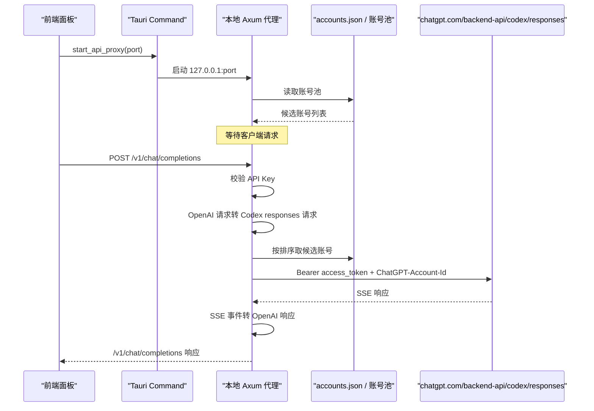

# API 反代链路说明

本文说明当前项目中的 API 反代实现。目标是让你从入口到上游返回，完整看懂这条链路现在是怎么工作的。

当前版本已经只保留一种反代方式：

- 本地对外暴露 OpenAI 兼容接口
- 上游统一转到 Codex 的 `chatgpt.com/backend-api/codex/responses`
- 不再保留旧的多模式反代
- Axum 请求体大小上限默认放宽到 `512 MiB`

实现参考了 `CLIProxyAPIPlus` 的 Codex executor 思路，但不是把它整仓搬进来，而是把核心方法收敛到本项目现有架构里。

## 1. 当前反代的定位

> 本文中的代码位置均为仓库相对路径，以仓库根目录为基准。

### 本地入口

- `GET /health`
- `GET /v1/models`
- `POST /v1/chat/completions`
- `POST /v1/responses`
- `GET /v1/responses`（WebSocket 升级，见第 13.3 节）
- `POST /v1/images/generations`
- `POST /v1/images/edits`
- `POST /v1/images/variations`

其余 `/v1/*` 路径统一由 fallback 返回“不支持”。

### 上游入口

- `POST https://chatgpt.com/backend-api/codex/responses`

也就是说：

- 客户端以为自己在调用 OpenAI 风格的 `/v1/*`
- 实际上本地代理会把请求转换为 Codex `responses` 协议
- 然后用账号池中的 ChatGPT/Codex 登录态去访问上游

## 2. 为什么这样设计

之前的问题有两个：

- 直接打 `api.openai.com/v1/*` 时，很多导入的账号本质上只有 ChatGPT/Codex 登录态，不一定有公共 OpenAI API scope 或 quota
- 旧的 `conversation` 直通方式过于贴近历史接口，不适合作为稳定代理基座

现在的方案本质上是：

- 下游维持 `/v1` 兼容，方便接各种现成客户端
- 上游切到 Codex 当前更合适的 `responses` 入口
- 中间由本地代理负责协议转换

## 3. 整体时序



## 4. 入口与生命周期

### 4.1 前端触发

前端入口在：

- `src/components/ApiProxyPanel.tsx`
- `src/hooks/useCodexController.ts`

用户在面板点击“启动 API 反代”后：

1. 前端读取端口输入框
2. 调用 Tauri 命令 `start_api_proxy`
3. 成功后显示：
   - `Base URL`
   - `API Key`
   - 当前命中的账号
   - 最近错误

### 4.2 Tauri 命令

Tauri 命令入口在：

- `src-tauri/src/lib.rs`

相关命令：

- `get_api_proxy_status`
- `start_api_proxy`
- `stop_api_proxy`

### 4.3 后端运行态

后端运行态在：

- `src-tauri/src/state.rs`

这里维护：

- 监听端口
- 当前代理 API Key
- 运行任务句柄
- 当前命中的账号 ID/标签
- 最近一次错误

## 5. 启动时到底做了什么

启动逻辑在：

- `src-tauri/src/proxy_service.rs`

`start_api_proxy_internal(...)` 做的事情是：

1. 检查当前是否已经有代理在运行
2. 从账号池加载可用账号
3. 绑定本地端口，默认 `8787`
4. 生成一个本地代理专用 `sk-...` API Key
5. 创建 `reqwest::Client`
6. 启动一个 `axum` HTTP 服务
7. 注册以下路由：
   - `/health`
   - `/v1/models`
   - `/v1/chat/completions`
   - `/v1/responses`
   - 对请求体启用 `512 MiB` 默认上限，可用 `CODEX_TOOLS_PROXY_MAX_BODY_MIB` 覆盖
8. 把运行状态写入全局 `AppState`

## 6. 本地暴露的接口

### 6.1 `GET /health`

用途：

- 用于判断本地代理服务是否活着

返回：

```json
{ "ok": true }
```

### 6.2 `GET /v1/models`

用途：

- 给兼容客户端一个模型列表

特点：

- 这里不是实时问上游拿模型
- 目前返回的是本地静态模型列表
- 目的是让大多数依赖 `/v1/models` 的客户端能正常初始化

### 6.3 `POST /v1/chat/completions`

用途：

- 兼容绝大多数 OpenAI Chat Completions 客户端

行为：

- 本地接收 OpenAI 风格请求
- 转为 Codex `responses` 请求
- 上游始终按 SSE 模式请求
- 如果下游请求 `stream: true`，本地再把上游 SSE 转成 OpenAI ChatCompletions SSE
- 如果下游请求 `stream: false`，本地会先收完整个 SSE，再拼成普通 JSON 返回

### 6.4 `POST /v1/responses`

用途：

- 给直接走 OpenAI Responses 风格的客户端使用

行为：

- 请求体不做大的协议改写，只做必要归一化
- 上游仍然统一发到 Codex `responses`
- `stream: true` 时近似透传 SSE
- `stream: false` 时从 SSE 中提取 `response.completed`，返回标准 JSON

## 7. 鉴权方式

本地代理有自己的一层鉴权，不直接暴露给任意本地程序。

支持两种传法：

- `X-API-Key: sk-...`
- `Authorization: Bearer sk-...`

校验逻辑：

- 只认启动代理时生成的那一个本地 `API Key`
- 这层 key 只是本地代理的门锁
- 它不是上游 OpenAI API Key
- 它也不是账号池里真实的 `access_token`

## 8. 账号池是怎么参与反代的

账号来源是应用数据目录下的 `accounts.json`，目录由 Tauri 按平台解析（应用标识 `com.carry.codex-tools`）：

- macOS：`~/Library/Application Support/com.carry.codex-tools/`
- Windows：`%APPDATA%\com.carry.codex-tools\`
- Linux：`~/.config/com.carry.codex-tools/`
- `codex-tools-proxyd`：由 `--data-dir` 指定，默认 `~/.codex-tools-proxyd`

调试构建下可用 `CODEX_TOOLS_DEV_DATA_DIR` 覆盖该目录，详见 `src-tauri/src/app_paths.rs`。

数据结构定义在：

- `src-tauri/src/models.rs`

每个账号核心字段有：

- `label`
- `account_id`
- `auth_json`
- `usage`
- `plan_type`

代理真正需要的认证信息来自 `extract_auth(...)`：

- `access_token`
- `account_id`
- 可选 `plan_type`

## 9. 账号排序与挑选规则

候选账号在每次请求时重新读取，并重新排序，不做固定缓存。

### 9.1 谁能成为候选账号

`account_to_proxy_candidate(...)` 会丢弃这几类账号：

- 在账号卡片上关掉了「参与反代」的账号
- 取不出 ChatGPT 登录态的账号（API 中转站条目就属于这类）
- 刷新已被停用且 `access_token` 也已过期的账号

因此 relay（上游渠道）和 unavailable（不可用）这两个账号池永远不会进入反代，
账号池筛选也不提供这两个选项。

### 9.2 账号池筛选

`设置 → 反代号池`（`api_proxy_account_pool_filter`）可以把反代限定到某一类账号：

- `all`：不限制
- `free` / `plus` / `pro` / `otherPlan`：按套餐限定
- `accessOnly`：只用「刷新已停用但 access_token 仍有效」的账号

筛选在 `load_proxy_candidate_selection(...)` 里先于去重执行。
前端面板顶部的「可用账号」数量同样按这个口径统计
（`src/utils/apiProxyAccounts.ts`），所以面板显示 0 时启动按钮就是禁用的。

### 9.3 排序规则

`compare_proxy_candidates(...)` 依次比较：

1. 刷新被停用的账号排在前面（趁 `access_token` 还没过期先用掉）
2. `free` 计划优先于其他计划
3. `1week` 已用百分比更低的优先
4. `5h` 已用百分比更低的优先
5. 最后按标签名、账号键稳定排序

### 9.4 负载均衡模式

`api_proxy_load_balance_mode` 有两种：

- `average`：完全按上面的排序结果，每次请求都重新挑“最有余量”的账号
- `sequential`：粘住当前账号，直到它的 `5h` 使用率超过
  `api_proxy_sequential_five_hour_limit_percent`（默认 80%）才切下一个

`sequential` 模式下当前账号会持久化到 `api_proxy_sequential_account_key`，
重启后继续从同一个账号开始。

对应逻辑：

- `load_proxy_candidate_selection(...)`
- `order_proxy_candidates_for_request(...)`
- `compare_proxy_candidates(...)`

### 9.5 账号冷却

`api_proxy_account_cooldown_enabled` 打开时（默认打开），账号因额度/限流类错误失败后
会进入 180 秒冷却，冷却期内不再被选中。冷却状态通过 `ApiProxyStatus.accountCooldowns`
回传给前端展示。

对应逻辑：

- `proxy_candidates_after_cooldowns(...)`
- `record_proxy_candidate_cooldown(...)`

## 10. 请求发到上游时带了什么

真正向上游发请求时，目标是：

- `https://chatgpt.com/backend-api/codex/responses`

关键请求头：

- `Authorization: Bearer <candidate.access_token>`
- `ChatGPT-Account-Id: <candidate.account_id>`
- `Originator: codex_cli_rs`
- `Version: 0.125.0`
- `Session_id: <uuid>`
- `User-Agent: codex_cli_rs/0.125.0 (...)`
- `Accept: text/event-stream`
- `Content-Type: application/json`

这里有几个关键点：

- 不是发到 `api.openai.com/v1/*`
- 不是发到旧的 `conversation`
- 默认模拟的是 Codex CLI 风格头
- 上游固定按 SSE 返回

## 11. `chat/completions` 到 Codex `responses` 的转换

这是当前链路最核心的一层。

### 11.1 固定注入字段

本地会补这些字段：

- `stream: true`
- `store: false`
- `instructions: ""`
- `parallel_tool_calls: true`
- `reasoning.effort: medium`
- `reasoning.summary: auto`
- `include: ["reasoning.encrypted_content"]`

这里 `store: false` 很关键。

实际验证里，上游 `backend-api/codex/responses` 明确要求：

- 没带 `store: false` 会报错

### 11.2 message 角色映射

OpenAI 风格消息会被转换为 Codex `input` 数组。

角色映射：

- `system -> developer`
- `developer -> developer`
- `user -> user`
- `assistant -> assistant`
- `tool -> function_call_output`

### 11.3 content 映射

文本：

- `text -> input_text` 或 `output_text`

图片：

- `image_url -> input_image`

文件：

- `file -> input_file`

### 11.4 tool 调用映射

OpenAI 里的：

- `assistant.tool_calls`
- `tool` 消息

会被拆成 Codex 里的：

- `function_call`
- `function_call_output`

### 11.5 结构化输出映射

如果下游传了：

- `response_format`
- `text.verbosity`

本地会转换到上游的：

- `text.format`
- `text.verbosity`

## 12. `/v1/responses` 的归一化

如果下游直接请求 `/v1/responses`，本地不会像 `chat/completions` 那样大幅转换，只做必要补丁：

- 强制 `stream: true`
- 强制 `store: false`
- 缺失时补 `instructions`
- 缺失时补 `parallel_tool_calls`
- 缺失时补 `reasoning.effort = medium`
- 缺失时补 `reasoning.summary = auto`
- 确保 `include` 里有 `reasoning.encrypted_content`
- 丢弃上游不接受的 `metadata` 字段，避免 Cursor 等客户端报 `Unsupported parameter: metadata`

## 13. 上游 SSE 是怎么转回 OpenAI 的

### 13.1 `POST /v1/responses`

如果下游本来就是 Responses 客户端：

- `stream: true` 时，基本按 SSE 透回去
- `stream: false` 时，从完整 SSE 中提取 `response.completed`

### 13.2 `POST /v1/chat/completions`

这是转换最多的地方。

上游返回的是 Codex SSE 事件流，本地会把关键事件转成 OpenAI ChatCompletions SSE。

#### 事件映射

| 上游事件 | 本地输出 |
| --- | --- |
| `response.created` | 初始化状态，不立即输出 |
| `response.reasoning_summary_text.delta` | `delta.reasoning_content` |
| `response.reasoning_summary_text.done` | 补一个换行分隔 |
| `response.output_text.delta` | `delta.content` |
| `response.output_item.added` with `function_call` | `delta.tool_calls` 开始事件 |
| `response.function_call_arguments.delta` | `delta.tool_calls[].function.arguments` 增量 |
| `response.function_call_arguments.done` | 参数结束兜底 |
| `response.output_item.done` with `function_call` | 工具调用完成兜底 |
| `response.completed` | `finish_reason` + `[DONE]` |

#### 非流式时怎么处理

如果下游 `stream: false`：

1. 本地仍然向上游请求 SSE
2. 读完整个 SSE
3. 找到 `response.completed`
4. 从 `response.output` 里提取：
   - assistant 文本
   - reasoning summary
   - tool calls
   - usage
5. 拼成一个普通的 OpenAI ChatCompletions JSON

### 13.3 `GET /v1/responses`（WebSocket）

`GET /v1/responses` 会走 WebSocket 升级，给需要长连接的客户端使用：

1. 升级前同样校验本地 API Key
2. 升级后等待客户端发来第一条 `response.create` 消息
3. 把它按普通 `responses` 请求发到上游（仍然是 SSE）
4. 再把上游 SSE 事件逐条转成 WebSocket 消息回推
5. 收到 `response.completed` / `response.failed` 等终止事件后关闭连接

不是 WebSocket 升级请求时返回 `426 Upgrade Required`。

需要注意：**到上游的 WebSocket 直连目前是关闭的**。
`should_use_responses_websocket(...)` 当前恒返回 `false`，
所以 `connect_codex_websocket(...)` / `forward_codex_websocket_request_with_candidate(...)`
这条上游直连路径虽然已经写好（含 `HTTP CONNECT` 代理隧道与
`responses_websockets=2026-02-06` beta 头），但暂未启用，
下游 WebSocket 的上游侧依然走 SSE。

### 13.4 图片接口

`/v1/images/generations`、`/v1/images/edits`、`/v1/images/variations`
会被改写成一次带图片工具的 Codex `responses` 调用：

- 控制模型默认 `gpt-5.5`，图片工具模型默认 `gpt-image-2`
- `edits` / `variations` 走 multipart，图片和 mask 会转成 `input_image`
- 只支持 `response_format=b64_json`，传 `url` 会直接报错
- 上游返回后从 `response.output` 里抽出图片，拼成 OpenAI Images 响应

## 14. 失败重试与自动切号

每次请求会按候选账号顺序尝试。

对单个账号的流程：

1. 先用当前 token 发上游请求
2. 如果命中“疑似 token 过期/失效”信号，则先 refresh
3. refresh 成功后重试这个账号一次
4. 如果仍失败，再判断是否属于可切下一个账号的错误

### 14.1 会触发 refresh 的情况

- `401`
- 错误体包含：
  - `token expired`
  - `jwt expired`
  - `invalid token`
  - `session expired`
  - `login required`

### 14.2 refresh 成功后还会做什么

刷新成功后会把新的认证状态写回两处：

- 账号池里的 `accounts.json`
- 如果它正好是当前激活账号，也会回写 `~/.codex/auth.json`

## 15. 失败分类

如果某个账号失败，本地会尽量分类，而不是只报一个泛泛的 `429`。

当前分类：

- `额度用完`
- `频率限制`
- `模型受限`
- `鉴权失败`
- `权限不足`

当所有候选账号都失败时，会返回类似：

- 哪一类失败有多少个
- 再附一个示例原因

这样你能更快判断是：

- 账号整体没额度
- 当前模型不支持
- 还是登录态坏了

## 16. 最近错误和当前账号是怎么展示的

运行中的状态会保存在：

- `ApiProxyRuntimeSnapshot`

主要字段：

- `active_account_id`
- `active_account_label`
- `last_error`

前端轮询这些状态，所以面板上能看到：

- 当前命中的账号
- 最近一次错误

## 17. Cloudflared 和反代的关系

Cloudflared 不是第二套代理逻辑，它只是把当前本地代理继续暴露到公网。

关系是：

1. 本地 API 反代先启动
2. Cloudflared 再把这个本地端口转出去

所以链路是：

```text
客户端 -> cloudflared 公网地址 -> 本地 127.0.0.1:8787/v1/* -> Codex 上游
```

Cloudflared 不参与：

- 请求协议转换
- 账号挑选
- token refresh
- SSE 到 OpenAI 的映射

它只负责公网入口。

## 18. 为什么没有用 `responses/compact`

当前实现统一走：

- `backend-api/codex/responses`

没有走：

- `backend-api/codex/responses/compact`

原因是实际验证里：

- `/responses` 是当前主路径，SSE 和普通返回都能靠它做出来
- `/responses/compact` 在部分情况下兼容性不稳定
- 当前项目先追求稳定链路，不再引入第二条上游分支

## 19. 当前的边界与限制

当前版本不是“完整 OpenAI API 网关”，而是“OpenAI 兼容的 Codex 代理”。

明确限制：

- 只支持第 1 节列出的那几条路径，其他 `/v1/*` 一律返回不支持
- 模型列表是本地静态表，不是实时探测
- `/v1/responses` 的流式是近似透传，不额外做深层语义改写
- 图片接口只支持 `response_format=b64_json`
- 到上游的 WebSocket 直连已实现但未启用（见 13.3）
- API 中转站（relay）账号不参与反代，反代只用 ChatGPT/Codex 登录态
- 核心目标是把最常用的聊天链路稳定打通

## 20. 代码位置索引

如果你要继续看代码，优先看这些文件：

- 启动、路由、转换、账号轮换：
  - `src-tauri/src/proxy_service.rs`
- Tauri 命令：
  - `src-tauri/src/lib.rs`
- 运行态：
  - `src-tauri/src/state.rs`
- 账号结构与设置项：
  - `src-tauri/src/models.rs`
- 独立代理进程：
  - `src-tauri/src/proxy_daemon.rs`
- 前端面板：
  - `src/components/ApiProxyPanel.tsx`
- 前端控制器：
  - `src/hooks/useCodexController.ts`
- 前端候选账号口径：
  - `src/utils/apiProxyAccounts.ts`

## 21. 一个完整请求示例

以这个调用为例：

```bash
curl http://127.0.0.1:8787/v1/chat/completions \
  -H 'Content-Type: application/json' \
  -H 'Authorization: Bearer sk-xxxx' \
  -d '{
    "model": "gpt-5",
    "stream": false,
    "messages": [
      { "role": "user", "content": "1+1 等于几？只回答结果。" }
    ]
  }'
```

内部实际流程是：

1. 本地校验 `sk-xxxx`
2. 找到可用账号列表
3. 把请求改写成 Codex `responses` 请求
4. 强制补 `store: false`
5. 带着账号 `access_token + account_id` 去打上游
6. 上游返回 SSE
7. 本地抽取 `response.completed`
8. 转成 OpenAI ChatCompletions JSON
9. 返回类似：

```json
{
  "object": "chat.completion",
  "choices": [
    {
      "message": {
        "role": "assistant",
        "content": "2"
      },
      "finish_reason": "stop"
    }
  ]
}
```

## 22. 调试方式

### 看服务是否起来

```bash
curl http://127.0.0.1:8787/health
```

### 看模型列表

```bash
curl http://127.0.0.1:8787/v1/models -H 'Authorization: Bearer 你的sk'
```

### 看聊天结果

```bash
curl http://127.0.0.1:8787/v1/chat/completions \
  -H 'Content-Type: application/json' \
  -H 'Authorization: Bearer 你的sk' \
  -d '{"model":"gpt-5","stream":false,"messages":[{"role":"user","content":"1+1 等于几？只回答结果。"}]}'
```

### 保留原始响应

加 `-i` 连响应头一起打出来，再重定向到文件即可：

```bash
curl -i http://127.0.0.1:8787/v1/chat/completions \
  -H 'Content-Type: application/json' \
  -H 'Authorization: Bearer 你的sk' \
  -d '{"model":"gpt-5","stream":true,"messages":[{"role":"user","content":"1+1 等于几？只回答结果。"}]}' \
  > proxy-raw.log 2>&1
```

### 看后端日志

调试构建会启用 `tauri-plugin-log`，账号挑选、刷新、切号失败等都会打到应用日志里。
反代自身的最近一次错误也会通过 `ApiProxyStatus.lastError` 显示在面板上。

## 23. 通过 CC Switch 接入 Codex

如果你想把本工具作为“账号池 + OpenAI 兼容反代”，再由 [CC Switch](https://github.com/farion1231/cc-switch) 来统一管理 Codex provider，这条链路是支持的。

原因很简单：

- 本工具下游暴露的是 OpenAI 兼容 `/v1` 接口
- CC Switch 给 Codex 写入的自定义 provider 也是 `OPENAI_API_KEY + base_url + wire_api = "responses"` 这套配置

也就是说：

- `codex-tools -> CC Switch -> Codex`
- 协议层是能对上的

### 23.1 适用范围

当前这套接入方式，适用于：

- CC Switch 中的 **Codex 自定义 provider**

不适用于：

- 直接把这个地址当成 **Claude 原生 provider** 去直连

原因是本工具当前只提供 OpenAI 兼容出口：

- `GET /v1/models`
- `POST /v1/chat/completions`
- `POST /v1/responses`

并没有直接提供 Anthropic Messages 协议。

### 23.2 推荐配置

在 CC Switch 中新增一个 Codex 自定义 provider，可按下面填写。

`auth.json`：

```json
{
  "OPENAI_API_KEY": "这里填 codex-tools 面板里生成的 sk-..."
}
```

`config.toml`：

```toml
model_provider = "codex_tools"
model = "gpt-5.4"
model_reasoning_effort = "high"
disable_response_storage = true

[model_providers.codex_tools]
name = "codex_tools"
base_url = "http://127.0.0.1:8787/v1"
wire_api = "responses"
requires_openai_auth = true
```

如果你不是本机直连，而是通过 cloudflared 公网域名接入，把 `base_url` 改成：

```toml
base_url = "https://你的公网域名/v1"
```

### 23.3 三个最容易配错的点

1. `base_url` 要填到 `/v1` 为止
   - 对：`http://127.0.0.1:8787/v1`
   - 错：`http://127.0.0.1:8787`
   - 错：`http://127.0.0.1:8787/v1/responses`

2. `OPENAI_API_KEY` 要填本工具生成的代理 key
   - 也就是面板显示的 `sk-...`
   - 不是 OpenAI 官方 API Key
   - 也不是账号池里真实的 `access_token`

3. `wire_api` 要用 `responses`
   - 因为本工具上游统一走的是 Codex `responses`
   - CC Switch 的 Codex 自定义 provider 也应使用 `responses`

### 23.4 接不通时先排查什么

先直接测本工具自己的出口：

```bash
curl http://127.0.0.1:8787/health
curl http://127.0.0.1:8787/v1/models -H 'Authorization: Bearer 你的sk'
```

如果这两个请求都正常：

- 说明 `codex-tools` 代理本身已经起来了
- 后续问题通常就在 CC Switch 的 provider 配置

如果本机地址可以通，但外网地址不通，优先检查：

- cloudflared 是否真的映射到了当前反代端口
- `base_url` 是否写成了公网域名加 `/v1`
- 外部客户端是否带上了 `Authorization: Bearer sk-...`

### 23.5 关于 Claude provider

如果你在 CC Switch 里配置的是 Claude provider，而不是 Codex provider，需要注意：

- 本工具不能作为 Claude 原生接口直连
- 这时应由 CC Switch 自己负责协议转换
- 在 CC Switch 中把 API 格式切到 `OpenAI Responses API` 才有机会接上本工具

## 24. 一句话总结

当前反代的本质是：

- 本地对客户端说“我是 OpenAI `/v1`”
- 对上游实际上说“我是 Codex CLI，在调用 `backend-api/codex/responses`”
- 中间靠账号池、协议转换、SSE 事件转换，把两边接起来
